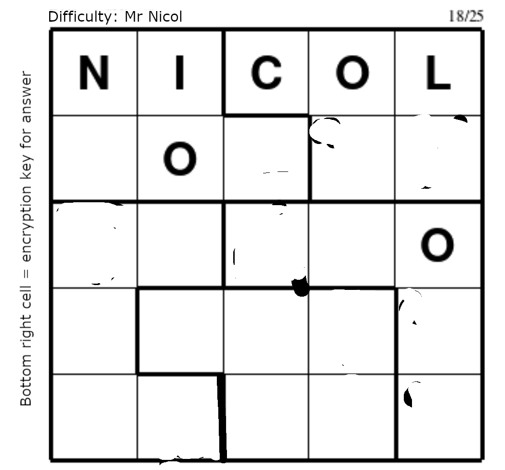

> [!WARNING]
> Urgent: You must be (or know) a dunce to read this.

# Dunce's Theorem

## Overview

**Dunce's Theorem** is a complicated mathematical theorem that explores the impact of a student wearing a dunce cap on the average intelligence of a classroom. It suggests that the presence of a dunce cap not only affects individual performance but also has a disproportionately large effect on the perceived intelligence of the entire group, especially in larger classrooms.

## Theorem Statement

In any classroom of students, if one student is wearing a dunce cap, then the average intelligence of the group decreases by a factor proportional to the square of the number of students present, influenced by the size of the dunce cap.

## Definitions

- **Intelligence (I)**: A hypothetical measure of a student's cognitive abilities, represented as a numerical value.
- **Dunce Cap (D)**: A symbolic representation of a student whose intelligence is significantly lower than the average of the group.
- **Classroom Size (n)**: The total number of students in the classroom.
- **Radius of the Dunce Cap (r)**: A measure of the size of the dunce cap, which humorously affects the "dunce effect."
- **Size of the Dunce Cap (S_d)**: The volume of the dunce cap, calculated as 

$$ S_d = \frac{1}{3} \pi r^2 h $$ 

(assuming a conical shape for simplicity).

## Theorem Formulation

Let:
- $I$ = average intelligence of the students without the dunce cap.
- $D$ = intelligence of the student wearing the dunce cap, where $D < I$.
- $n$ = total number of students in the classroom.
- $r$ = radius of the dunce cap.

The new average intelligence $ I' $ when one student wears a dunce cap is given by:

$$I' = \frac{(n-1)I + D}{n}$$

### Incorporating the Size of the Dunce Cap

The size of the dunce cap can be humorously linked to the impact it has on the average intelligence. We introduce a factor $ f(r) $ that represents the influence of the radius of the dunce cap on the average intelligence:

$$f(r) = k \cdot r^2$$

The revised average intelligence can now be expressed as:

$$I' = I - f(r) \cdot n^2$$

### Series to Infinity

To explore the cumulative effect of multiple dunce caps as the classroom size approaches infinity, we define a series $ S $:

$$S = \sum_{n=1}^{\infty} \left( k \cdot r^2 \cdot n^2 \right)$$

This series diverges, indicating that as the classroom size increases indefinitely, the cumulative effect of the dunce caps leads to an infinite decrease in average intelligence.

## Implications

- **Classroom Dynamics**: The theorem humorously suggests that the presence of a student with significantly lower intelligence can have a disproportionately large effect on the perceived intelligence of the group.
- **Social Commentary**: It serves as a light-hearted commentary on group dynamics, where one individual's performance can influence the overall perception of a team or class.
- **Educational Strategies**: Educators might use this theorem to emphasize the importance of fostering a supportive environment where all students can thrive.

## Applications

- **Classroom Activities**: Teachers could create activities that highlight the importance of collaboration and support, using the "Dunce's Theorem" as a fun reference point.
- **Humorous Discussions**: The theorem could be used in discussions about intelligence, learning styles, and the importance of inclusivity in education.
- **Mathematical Jokes**: It could serve as a basis for jokes or anecdotes in math classes, making the learning environment more engaging.

## Conclusion

The Dunce's Theorem is a playful exploration of group dynamics and the impact of individual differences in a classroom setting. It encourages a positive approach to education, emphasizing collaboration and support among students.

**Note**: This theorem is entirely fictional and meant for entertainment purposes. It does not reflect any real mathematical principles or theories!
